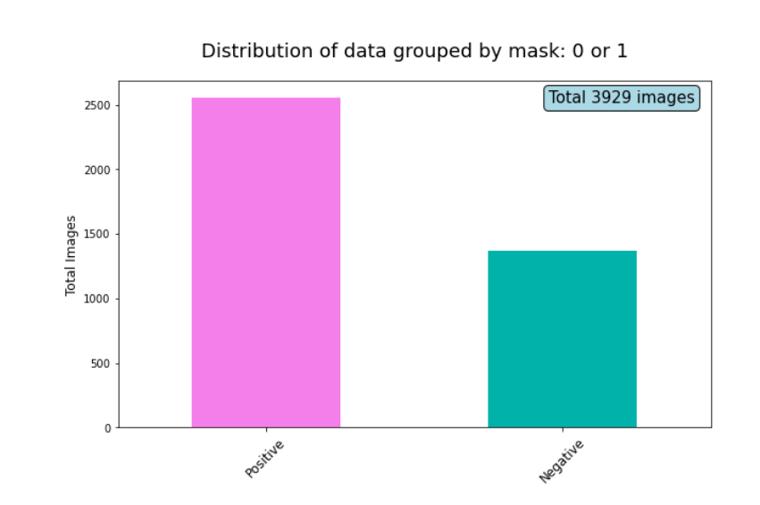
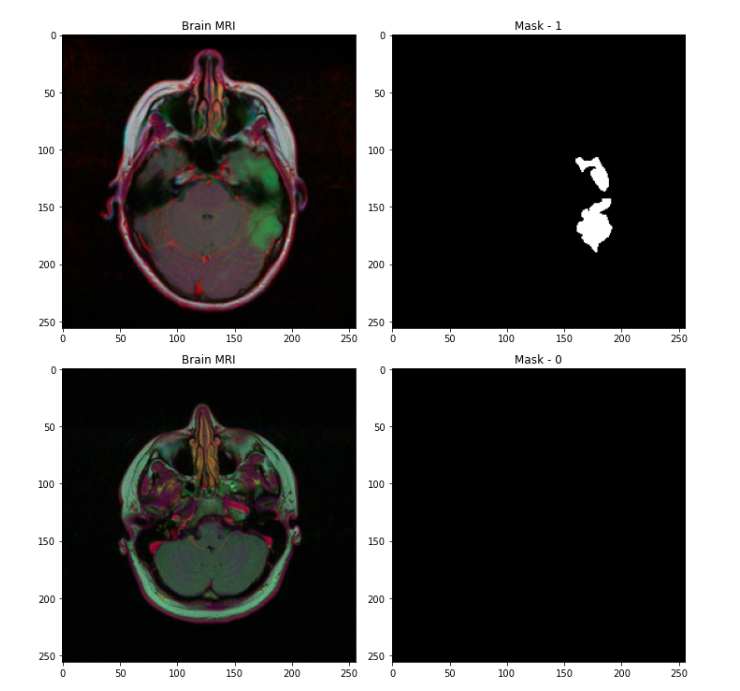
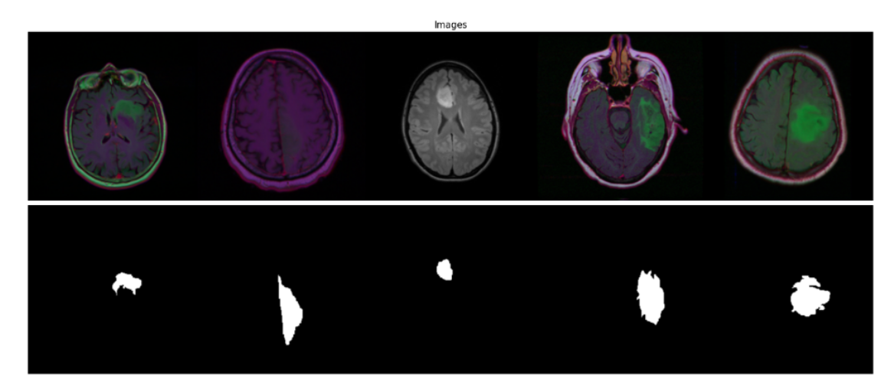
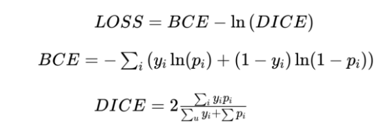
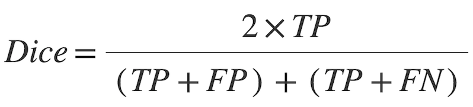
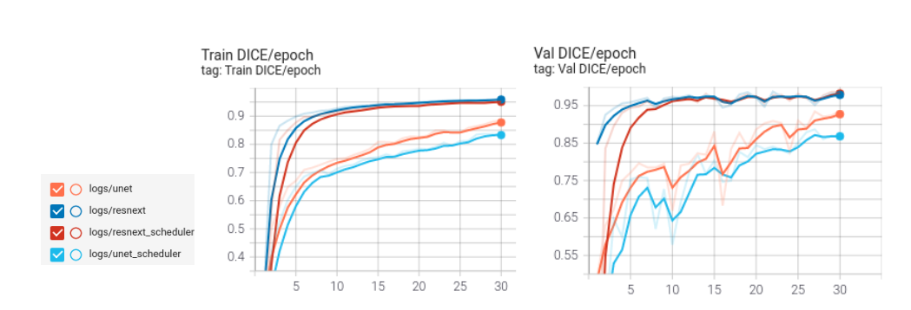
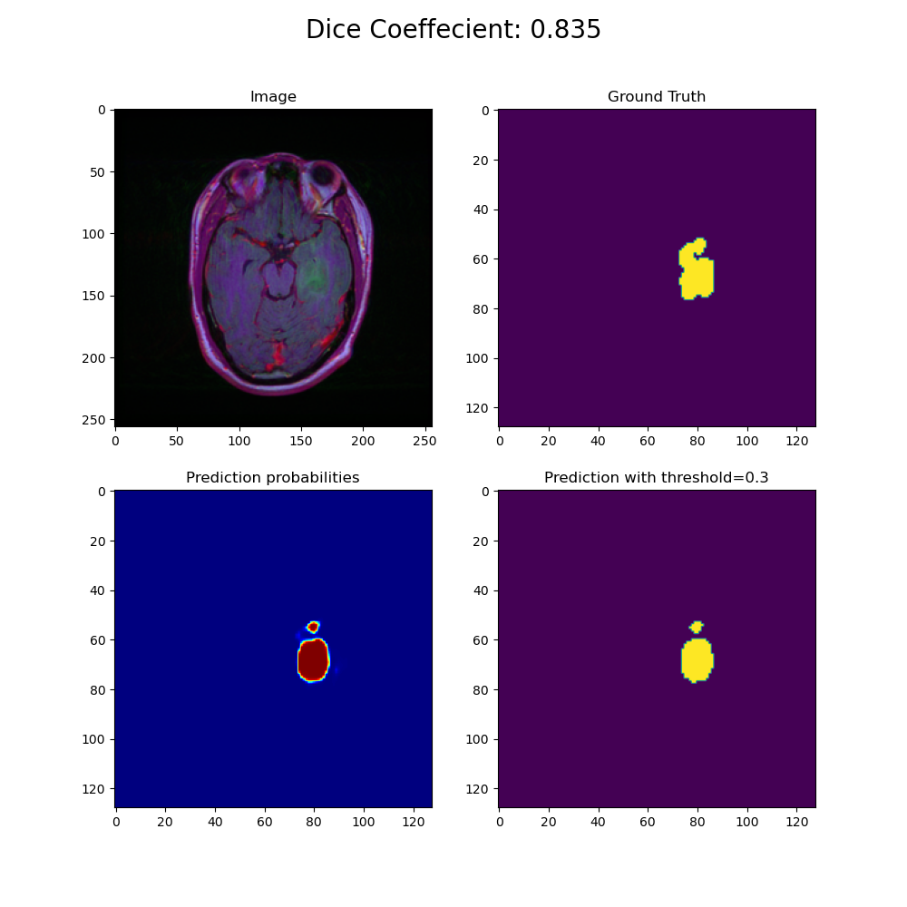
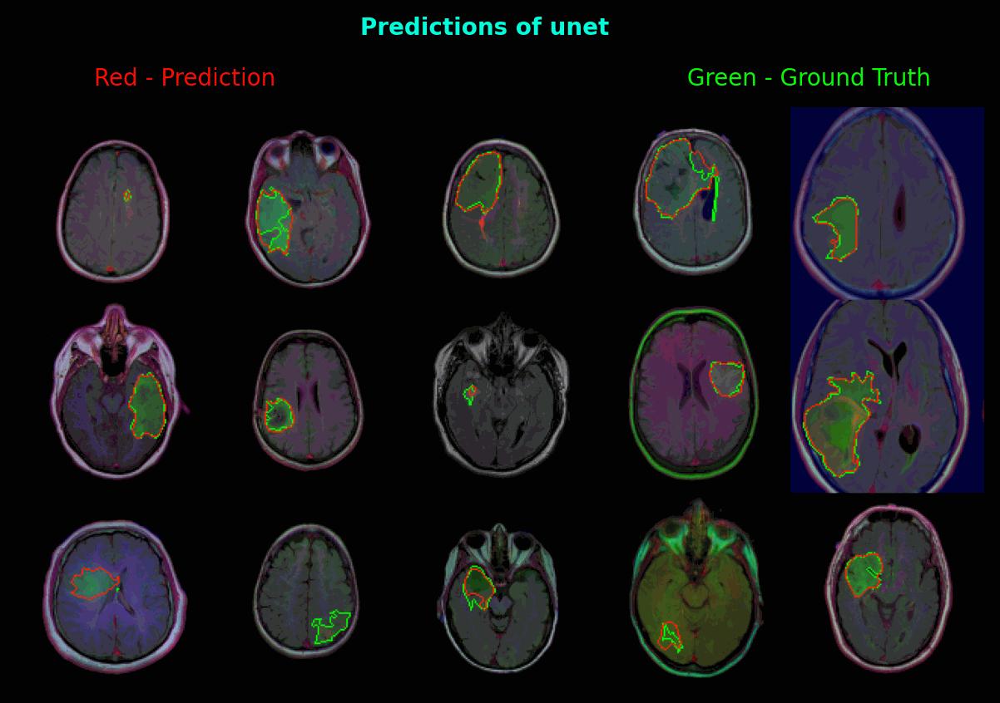

# Deep Learning for Brain MRI segmentation 

Personal project for understanding and implementing Brain MRI segmentation 
using Transfer Learning in Pytorch. 

## Overview
Quantitative analysis of brain MRI is routine for many neurological diseases and conditions and relies on accurate
segmentation of structures of interest. Deep learning-based segmentation approaches for brain MRI are gaining interest 
due to their self-learning and generalization ability over large amounts of data.

Here, 2 pre-trained model architectures: UNet and Unet with ResNext backbone were trained and evaluated for Dice scores on 
Brain MRI dataset obtained from The Cancer Imaging Archive (TCIA).

## Table of Contents

- [Installation](#installation)  
- [Usage](#usage)  
- [Dataset](#dataset)    
- [Training and Results](#training-and-results)    
- [License](#license)
- [Acknowledgements](#acknowledgements)     
- [Footer](#footer)
      
### Installation
Clone project:
```
git clone https://github.com/Nishita-Kapoor/brain_mri_segmentation.git
```
Once cloned, install packages:
```
pip install -r requirements.txt
```
### Usage
To train the model, run:
```python main.py --train=True``` 

Other optional arguments:

|   argument    |  type    | default  |            description                          |
| ------------- |:--------:|:--------:| -----------------------------------------------:|
|  --view_aug   |   bool   |    False |       visualize image augmentations             |
|  --num_epochs |   int    |    30    |            num of epochs                        |
|  --test       |   bool   |   True   |            test the model                       |
|  --gpus       |   str    |    0     |           which gpu to use                      |
|  --root_dir   |   str    |  {path}  |           path of dataset directory             |
|  --run_name   |   str    |    0     |           training run names                    |
|  --batch_size |   int    |    32    |             batch size                          |
|--lr_scheduler |   bool   |    False |          using learning scheduler               |
|  --image_path |   str    |  {path}  | path for single image prediction (inference)    |
|  --model      |   str    |    unet  | choose model between 'unet' or 'resnext'        |


### Dataset
The Dataset used is: Brain MRI Segmentation by Mateusz Buda from [Kaggle](https://www.kaggle.com/mateuszbuda/lgg-mri-segmentation).

This dataset contains brain MR images together with manual FLAIR abnormality segmentation masks.The images were obtained
from The Cancer Imaging Archive (TCIA).
They correspond to 110 patients included in The Cancer Genome Atlas (TCGA) lower-grade glioma collection with
at least fluid-attenuated inversion recovery (FLAIR) sequence and genomic cluster data available.
Tumor genomic clusters and patient data is provided in data.csv file.

The dataset was explored in the ```data/brain_mri_EDA.ipynb``` notebook of this repo, including
data distributions and visualizations of the MRI with corresponding masks. The dataset was split as per following:

```
Dataset:
Number/Size of Images   : Total      : 3929
                          Training set   : 3143 
                          Validation set : 393 
                          Test set       : 393  
```
Of the total 3929 images, the distribution of positive (mask:1) and negative (mask:0) segmentation is as follows:



#### Sample Input Images:




Some sample images having a positive diagnosis (mask=1):




### Training and Results: 

Trainings were performed on Google Colab, with following parameters, in order to compare and select the
best model performance.
- learning rate: 5e-4
- epochs: 30
- batch size: 32
- evaluation metric: dice co-efficient
- Optimizer: Adamax
- Models: 'Unet' vs 'Unet with ResNeXt50' backbone

#### Segmentation Loss: 



#### Dice Metric:




Training and validation curves were visualized on Tensorboard and Dice co-efficients were evaluated
for the test set.



#### Results

The following dice scores were reported on the test set. As can be seen, using a Learning rate scheduler
did not really improve performance. Also, the Unet+ResNext model seems to perform better than the classic Unet.

  
|                       |   Unet  | Unet+ResNext| 
| --------------------- |:--------|:-----------:|
| lr_scheduler = True   | 0.82    |   0.96      |  
| lr_scheduler = False  | 0.91    |   0.96      |  


#### Prediction
Comparing prediction vs ground truth of an MR image, as predicted by the Unet model:



Overlapping ground truth with prediction contours to visualize and compare model predictions with masks:



### License
Please see [LICENSE](./LICENSE)
    
### Acknowledgements
The project is intended as a learning experience. 
References:
- [https://github.com/OldBonhart/Brain_MRI_Segmentation](https://github.com/OldBonhart/Brain_MRI_Segmentation)
- [https://github.com/mateuszbuda/brain-segmentation-pytorch](https://github.com/mateuszbuda/brain-segmentation-pytorch)
- [https://medium.com/kaggle-blog/carvana-image-masking-challenge-1st-place-winners-interview-78fcc5c887a8](https://medium.com/kaggle-blog/carvana-image-masking-challenge-1st-place-winners-interview-78fcc5c887a8)

### Footer
Please feel free to contribute/use the repo as per need. In case of any questions,
you can reach me at <nishita.s66@gmail.com>